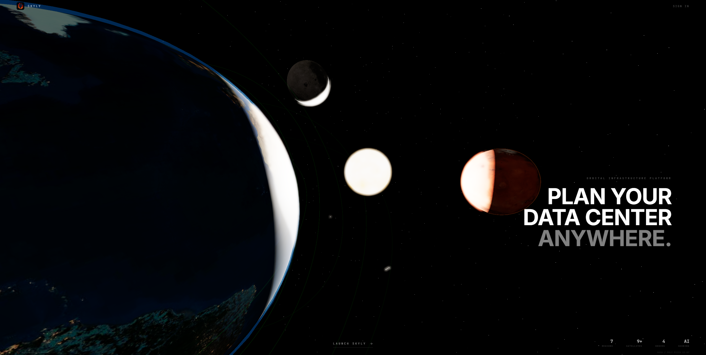
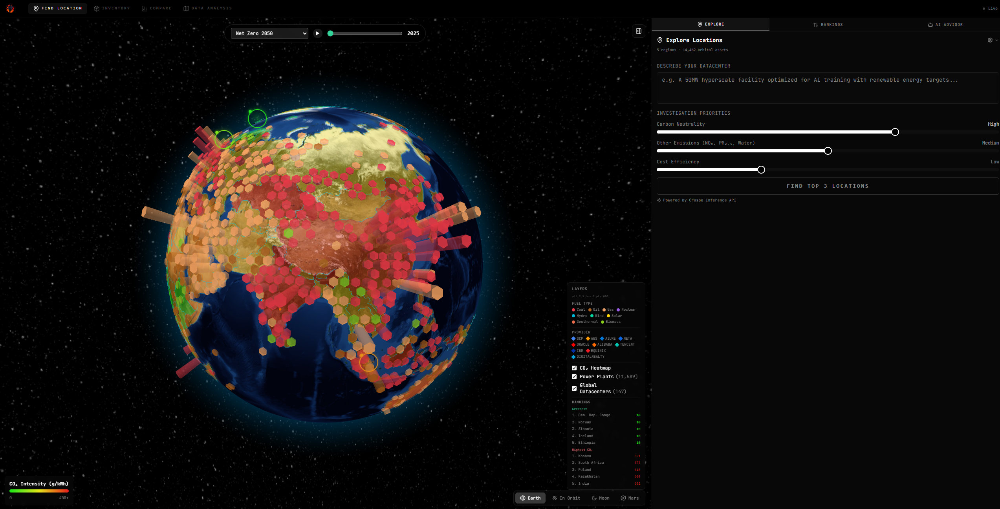
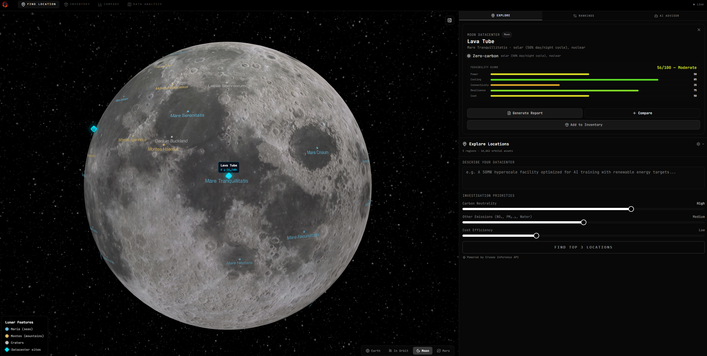
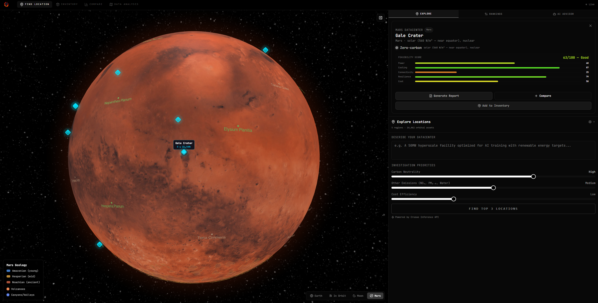
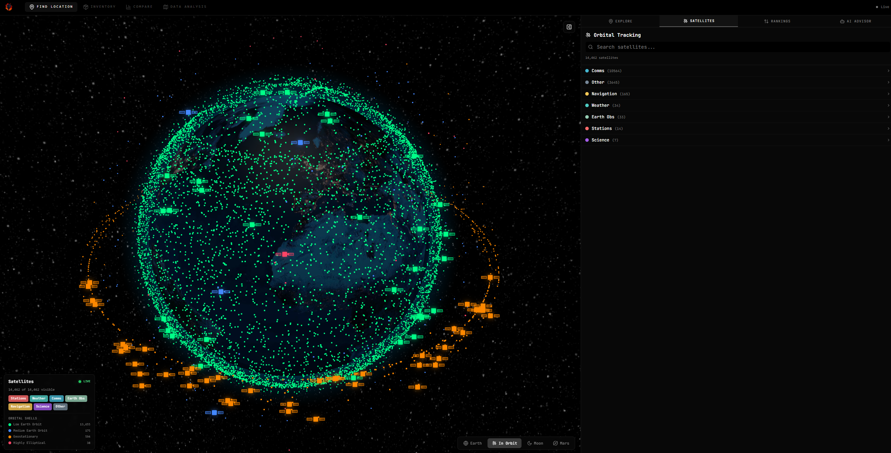
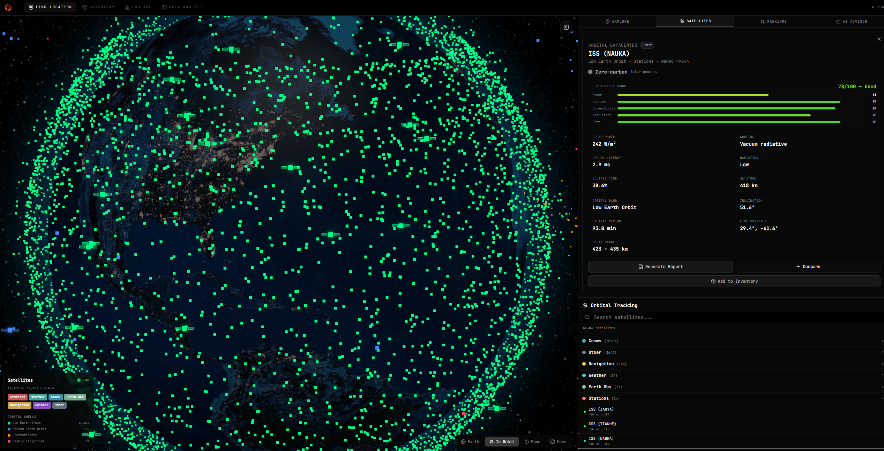

# Orbital Atlas — Data Center Feasibility Estimator

> *"The same tool that helps you pick between Iceland and Singapore today will help you evaluate the lunar south pole tomorrow."*

**Orbital Atlas** is a 3D interactive solar system explorer where users evaluate data center placement across Earth, the Moon, and Mars. Powered by AI-generated feasibility reports, blockchain-verified portfolio records, and real sustainability data — built in 48 hours at **HackEurope Dublin 2026**.


---








## What It Does

Rotate an interactive 3D globe, click any location — from Reykjavik to the lunar south pole — and get an AI-generated data center feasibility report covering cost, power, cooling, latency, carbon footprint, and risk. Then chat with an AI infrastructure advisor, build your portfolio, and get blockchain-verified receipts for approved sites.

### Core User Flows

**Explore & Estimate** — Rotate the 3D globe (Earth/Moon/Mars) → click a location → see a 6-axis scorecard (cost, power, cooling, latency, carbon, risk) → drill into a full construction blueprint

**Ask the AI Advisor** — Natural language queries like *"I need 100MW with low carbon and <30ms to EU"* → Claude analyzes 40+ locations against your existing inventory → recommends top sites with reasoning

**Build & Track** — Approve a recommended site → added to inventory → Solana receipt minted on-chain → Stripe payment processed → portfolio dashboard updates with real-time analytics

**Portfolio Intelligence** — Dashboard shows coverage maps, carbon footprint tracking, capacity metrics, and AI-powered gap analysis across your entire infrastructure

---

## Architecture

```
┌──────────────────────────────────────────────────────┐
│             FRONTEND  (React + Three.js)              │
│  ┌──────────┐  ┌──────────┐  ┌────────────────────┐  │
│  │ 3D Globe │  │   Chat   │  │    Dashboard       │  │
│  │ (Earth / │  │ Advisor  │  │ (Inventory +       │  │
│  │Moon/Mars)│  │          │  │  Portfolio Stats)  │  │
│  └────┬─────┘  └────┬─────┘  └────────┬───────────┘  │
└───────┼──────────────┼─────────────────┼──────────────┘
        │              │                 │
        ▼              ▼                 ▼
┌──────────────────────────────────────────────────────┐
│               BACKEND  (Ruby on Rails)                │
│  ┌──────────────┐  ┌───────────────────────────────┐  │
│  │ Location API │  │ Report Generator (Claude AI)  │  │
│  │ (40+ sites)  │  │ Scorecard + Blueprint + Chat  │  │
│  └──────────────┘  └───────────────────────────────┘  │
│  ┌──────────────┐  ┌────────────┐  ┌──────────────┐  │
│  │   Stripe     │  │   Solana   │  │   Paid.ai    │  │
│  │   Billing    │  │   Minting  │  │   Metering   │  │
│  └──────────────┘  └────────────┘  └──────────────┘  │
└──────────────────────────────────────────────────────┘
                           │
                           ▼
┌──────────────────────────────────────────────────────┐
│          SOLANA SERVICE  (Rust + Axum)                │
│  Memo transactions on Solana devnet                   │
│  On-chain portfolio records with tx verification      │
└──────────────────────────────────────────────────────┘
```

---

## Tech Stack

| Layer | Technology | Purpose |
|-------|-----------|---------|
| **Frontend** | React 19, TypeScript, Vite | SPA framework |
| **3D Rendering** | Three.js, React Three Fiber, react-globe.gl | Interactive Earth/Moon/Mars globes |
| **UI** | Tailwind CSS, shadcn/ui (Radix), Recharts | Components, charts, styling |
| **Backend** | Ruby on Rails 7.1, Puma | REST API server |
| **AI** | Claude API (Anthropic SDK) with structured tool use | Report generation, advisor chat, recommendations |
| **Payments** | Stripe Checkout + Webhooks | Per-blueprint billing ($299/report) |
| **Blockchain** | Solana devnet, Rust, Axum | On-chain portfolio record minting |
| **Metering** | Paid.ai | AI usage tracking and billing |
| **Database** | SQLite (dev) / PostgreSQL (prod) | Data persistence |
| **Deployment** | Docker, Docker Compose | Containerized services |

---

## Challenges Targeted (10/10)

This project was designed to compete across **10 hackathon challenges simultaneously**, integrating each sponsor's technology as a core feature:

| Challenge | Prize | How We Used It |
|-----------|-------|----------------|
| **Claude API** | $10,000 | Core AI engine — generates all feasibility reports, powers the chat advisor, runs agentic tool-use loops for recommendations |
| **Best Use of Data** | €7,000 | Real energy prices, carbon intensity, climate data, latency metrics, and political stability scores across 40+ global and extraterrestrial locations |
| **Crusoe Inference** | $5,000 | Claude runs on Crusoe's clean-energy GPU infrastructure |
| **Solana** | €3,500 | Approved data center plans minted as verifiable on-chain portfolio records via memo transactions |
| **Stripe** | €3,000 | Per-report payment flow — free scorecards, paid blueprints with full Checkout + webhook integration |
| **Rails** | €2,000 | Entire backend API built on Ruby on Rails 7.1 |
| **Sustainability** | €1,000 | Core theme — evaluating environmental impact of data center placement globally and beyond |
| **Lovable** | €1,000 | Frontend scaffolded with Lovable, featuring 3D globe, dashboard, and landing page |
| **Paid.ai** | Office + 2yr | Usage-based metering tracks every AI report generated and value delivered |
| **Adaptable Agent** | Gift bags | AI adapts recommendations dynamically when inventory changes or energy prices shift |
| **Consulting Agent** | Team lunch | AI acts as an autonomous infrastructure consultant with tool access to portfolio data |

**Total prize pool targeted: ~€30,500+**

---

## AI Features (Claude Integration)

The backend uses Claude's **structured tool use** for agentic behavior. The AI advisor has access to 8 tools it can call autonomously in a loop:

| Tool | What It Does |
|------|-------------|
| `lookup_location` | Fetch detailed metrics for any location |
| `search_locations` | Filter locations by body, energy cost, carbon intensity |
| `compare_locations` | Side-by-side comparison of multiple sites |
| `calculate_costs` | Estimate build-out costs for a given capacity |
| `get_portfolio` | Read the user's current inventory and stats |
| `recommend_locations` | Analyze portfolio gaps and suggest optimal sites |
| `create_payment_link` | Generate Stripe checkout for blueprint purchase |
| `check_payment_status` | Verify payment completion |

### Report Types

- **Scorecard** (free) — 6-axis scoring (0-100), overall grade (A-F), executive summary, cost and timeline estimates
- **Blueprint** (paid, $299) — Phased construction plan, power strategy, cooling design, network topology, staffing plan, detailed cost breakdown, portfolio impact analysis

---

## API Endpoints

```
GET    /api/locations                   # Browse 40+ curated locations
GET    /api/locations/:id               # Location detail

POST   /api/reports/scorecard           # Generate AI feasibility scorecard
POST   /api/reports/blueprint           # Generate full AI blueprint (paid)

POST   /api/advisor/chat                # Chat with AI advisor (tool use)
POST   /api/advisor/recommend           # Get AI recommendations

GET    /api/inventory                   # User's data center portfolio
POST   /api/inventory                   # Add data center to portfolio
PATCH  /api/inventory/:id               # Update data center
DELETE /api/inventory/:id               # Remove data center

POST   /api/payments/checkout           # Create Stripe checkout session
GET    /api/payments/session/:id        # Check payment status
GET    /api/payments/blueprints         # List purchased blueprints
POST   /api/webhooks/stripe             # Stripe webhook handler

POST   /api/solana/mint                 # Mint on-chain portfolio record
GET    /api/portfolio/stats             # Portfolio analytics
POST   /api/predict/co2                 # CO2 footprint prediction
GET    /api/tle                         # Real-time satellite TLE data
GET    /api/planetary/:body/:dataset    # Moon/Mars region data
```

---

## Location Dataset

40+ curated locations across four celestial bodies, sourced from real-world data:

| Body | Locations | Data Sources |
|------|-----------|-------------|
| **Earth** | ~30 sites (Reykjavik, Singapore, Virginia, Dublin, Tasmania, ...) | IEA, Electricity Maps, NOAA, TeleGeography, World Bank |
| **Moon** | 5 sites (South Pole, Shackleton Crater, ...) | NASA Artemis, ESA lunar base studies |
| **Mars** | 3 sites (Hellas Basin, Olympus Mons, ...) | NASA Mars architecture studies |
| **Orbit** | 2 sites (LEO, GEO) | SpaceX rideshare pricing, satellite constellation data |

Each location includes: energy costs, carbon intensity, cooling methods, land costs, latency to markets (EU/US/APAC), disaster risk, political stability, regulatory environment, and connectivity options.

---

## Getting Started

### Prerequisites

- **Node.js 18+** and **bun** (frontend)
- **Ruby 3.2+** and **Bundler** (backend)
- **Rust** and **Cargo** (Solana service)
- **Docker** (optional, for containerized setup)

### Environment Variables

Copy the example env files and add your API keys:

```bash
cp backend/.env.example backend/.env
cp frontend/.env.example frontend/.env
```

Required keys: `CLAUDE_API_KEY`, `STRIPE_SECRET_KEY`, `STRIPE_WEBHOOK_SECRET`, `PAID_API_KEY`

### Running Locally

**Frontend:**
```bash
cd frontend
bun install
bun run dev          # http://localhost:5173
```

**Backend:**
```bash
cd backend
bundle install
rails db:create db:migrate
rails server         # http://localhost:3000
```

**Solana Service:**
```bash
cd solana
cargo run --bin keygen    # Generate devnet wallet (first time)
cargo run --bin server    # http://localhost:3001
```

**Docker (backend only):**
```bash
cd backend
docker compose up --build    # http://localhost:3002
```

---

## Project Structure

```
orbital-atlas/
├── frontend/          React 19 + Three.js + TypeScript
│   ├── src/
│   │   ├── pages/     Atlas (main app), Landing, Payment, Auth
│   │   ├── components/ GlobeView, ChatPanel, ScorecardPanel, InventoryPanel
│   │   └── lib/       API client, auth, constants
│   └── package.json
│
├── backend/           Ruby on Rails 7.1 API
│   ├── app/
│   │   ├── controllers/api/   10 API controllers
│   │   ├── services/          Claude, Location, Paid, Prediction services
│   │   └── tools/             8 Claude tool definitions
│   ├── Gemfile
│   └── Dockerfile
│
├── solana/            Rust microservice (Axum + Solana SDK v2.2)
│   ├── src/
│   │   ├── main.rs    HTTP server (/health, /mint)
│   │   ├── mint.rs    Memo transaction logic
│   │   └── wallet.rs  Keypair management
│   └── Cargo.toml
│
└── docs/              Design docs and implementation plans
```

---

## Team

Built by a team of 4 at **HackEurope Dublin 2026** (48-hour hackathon):

| Role | Responsibility |
|------|---------------|
| **Person 1** — Frontend | 3D globe, UI panels, landing page (Lovable + React) |
| **Person 2** — AI + Data | Location dataset curation, Claude prompts, report quality |
| **Person 3** — Backend | Rails API, Claude integration, Stripe/Paid wiring |
| **Person 4** — Blockchain + Integrations | Solana minting service (Rust), cross-service integration |

---

## License

Built for HackEurope Dublin 2026.
